# Johnny Five Autonomic Architecture

This document describes how the conscious mind (Hume EVI) interacts with the autonomic spine (muscle memory), and how the spine learns about hardware through adapters.

## Key Insight: Conscious vs Autonomic

Humans don't consciously think "contract bicep 30%, rotate shoulder 15°" when waving.
They think "wave hello" and their **spine/muscle memory** handles the details.

Johnny Five works the same way:
- **Hume EVI** = Conscious mind (conversation, decisions, personality)
- **Spine** = Autonomic reflexes (look at speaker, gesture while talking, safety alerts)
- **Adapter** = Hardware abstraction (Solo-CLI commands to Dynamixel motors)

---

## Diagram 1: Hume EVI ↔ Spine Interaction

```mermaid
flowchart TB
    subgraph CONSCIOUS["🧠 CONSCIOUS LAYER (Hume EVI)"]
        direction TB
        HUME[Hume EVI Cloud]
        WS[WebSocket Connection]
        JOHNNY5[johnny5.py]

        HUME <-->|"audio, messages"| WS
        WS <--> JOHNNY5
    end

    subgraph EVENTS["📡 EVENT BUS"]
        direction LR
        E1[speaking_started]
        E2[speaking_ended]
        E3[text_spoken]
        E4[person_recognized]
        E5[safety_alert]
    end

    subgraph SPINE["🦴 AUTONOMIC SPINE (Muscle Memory)"]
        direction TB

        subgraph ALWAYS_ON["Always Running (30Hz)"]
            HEAD[HeadTracker<br/>look at speaker]
            SAFETY[VisualSafety<br/>fire/smoke detection]
            TERRAIN[TerrainNavigator<br/>gap/cord detection]
        end

        subgraph TRIGGERED["Event-Triggered"]
            GESTURE[GestureSystem<br/>arm movement while talking]
            POINT[PointingSystem<br/>point at person on mention]
            EXPRESS[ExpressiveSystem<br/>emotion → body language]
        end

        COORD[MotionCoordinator<br/>orchestrates all movement]

        HEAD --> COORD
        SAFETY --> COORD
        TERRAIN --> COORD
        GESTURE --> COORD
        POINT --> COORD
        EXPRESS --> COORD
    end

    subgraph HARDWARE["⚙️ HARDWARE LAYER"]
        ADAPTER[Johnny5Adapter]
        SOLO[Solo-CLI]
        MOTORS[19 Dynamixel Servos]

        ADAPTER -->|"commands"| SOLO
        SOLO -->|"Protocol 2.0"| MOTORS
    end

    %% Conscious → Spine events
    JOHNNY5 -->|"speaking_started"| E1
    JOHNNY5 -->|"speaking_ended"| E2
    JOHNNY5 -->|"text: 'Hello Alan!'"| E3
    JOHNNY5 -->|"person: Alan @ 45°"| E4

    E1 --> GESTURE
    E2 --> GESTURE
    E3 --> POINT
    E3 --> EXPRESS
    E4 --> HEAD

    %% Spine → Conscious alerts
    SAFETY -->|"🔥 FIRE at 30°"| E5
    E5 -->|"interrupt conversation"| JOHNNY5

    %% Spine → Hardware
    COORD --> ADAPTER

    %% Styling
    classDef conscious fill:#e1f5fe,stroke:#01579b
    classDef spine fill:#fff3e0,stroke:#e65100
    classDef hardware fill:#f3e5f5,stroke:#7b1fa2
    classDef event fill:#e8f5e9,stroke:#2e7d32

    class HUME,WS,JOHNNY5 conscious
    class HEAD,SAFETY,TERRAIN,GESTURE,POINT,EXPRESS,COORD spine
    class ADAPTER,SOLO,MOTORS hardware
    class E1,E2,E3,E4,E5 event
```



### Event Flow Examples

**Example 1: Hume says "Hello Alan!"**
```
1. Hume generates audio → johnny5.py receives assistant_message
2. johnny5.py emits: speaking_started, text_spoken("Hello Alan!")
3. Spine receives events:
   - GestureSystem: starts subtle arm movement
   - PointingSystem: sees "Alan", checks if Alan is known
   - If Alan at 45° and not pointed at recently → point briefly
4. Spine sends commands to Adapter → Solo-CLI → Motors move
5. johnny5.py emits: speaking_ended
6. GestureSystem: returns arms to rest
```

**Example 2: Fire detected while Hume is talking**
```
1. VisualSafety (always running) detects orange/red in OAK-D frame
2. Spine IMMEDIATELY:
   - Interrupts current gesture
   - Both arms point at fire + twitch motion
   - Emits safety_alert to Event Bus
3. johnny5.py receives safety_alert
4. johnny5.py interrupts Hume: "I see fire at 30 degrees!"
5. Hume responds appropriately
```

---

## Diagram 2: Autonomic VLA Learning the Adapter

The spine doesn't hardcode Solo-CLI commands. It learns what the adapter can do
through a **capability discovery** pattern. This allows the same spine to work
with different robots (LeRobot, Aloha, etc.).

```mermaid
flowchart TB
    subgraph DISCOVERY["🔍 CAPABILITY DISCOVERY (Startup)"]
        direction TB

        BOOT[System Boot]
        DETECT[Detect Available Adapters]
        QUERY[Query Capabilities]
        BUILD[Build Action Vocabulary]

        BOOT --> DETECT
        DETECT --> QUERY
        QUERY --> BUILD
    end

    subgraph ADAPTERS["🔌 AVAILABLE ADAPTERS"]
        direction LR

        subgraph J5["Johnny5Adapter"]
            J5_CAP["capabilities:<br/>• arms: [left, right]<br/>• arm_dof: 6<br/>• gripper: true<br/>• base: mecanum<br/>• lift: true<br/>• gantry: 2-DOF"]
            J5_POSES["poses:<br/>• home<br/>• wave<br/>• point<br/>• arms_up"]
            J5_ACTIONS["actions:<br/>• move_to_position<br/>• gripper<br/>• base_move<br/>• wave<br/>• look_at"]
        end

        subgraph MOCK["MockAdapter"]
            MOCK_CAP["capabilities:<br/>• (simulated)"]
        end

        subgraph ALOHA["Future: AlohaAdapter"]
            ALOHA_CAP["capabilities:<br/>• dual 6-DOF arms<br/>• different motor layout"]
        end

        subgraph OPENDROID["Future: OpenDroidAdapter"]
            OD_CAP["capabilities:<br/>• humanoid form<br/>• legs + arms<br/>• different kinematics"]
        end
    end

    subgraph SPINE_VOCAB["🦴 SPINE ACTION VOCABULARY"]
        direction TB

        ABSTRACT["Abstract Intentions"]
        CONCRETE["Concrete Commands"]

        ABSTRACT -->|"maps to"| CONCRETE

        subgraph INTENTIONS["High-Level Intentions"]
            I1["look_at_speaker()"]
            I2["wave_hello()"]
            I3["point_at_fire()"]
            I4["express_excitement()"]
        end

        subgraph COMMANDS["Adapter-Specific Commands"]
            C1["gantry.look_at(pan, tilt)"]
            C2["right_arm.wave(style)"]
            C3["both_arms.point(direction)"]
            C4["both_arms.arms_up()"]
        end

        I1 -.-> C1
        I2 -.-> C2
        I3 -.-> C3
        I4 -.-> C4
    end

    subgraph EXECUTION["⚡ RUNTIME EXECUTION"]
        direction TB

        INTENT[Spine Intent:<br/>"wave at person"]
        LOOKUP[Lookup in Vocabulary]
        TRANSLATE[Translate to Adapter Action]
        EXECUTE[Execute via Adapter]
        FEEDBACK[Read Result]

        INTENT --> LOOKUP
        LOOKUP --> TRANSLATE
        TRANSLATE --> EXECUTE
        EXECUTE --> FEEDBACK
        FEEDBACK -->|"success/failure"| INTENT
    end

    %% Discovery flow
    BUILD --> SPINE_VOCAB
    J5 -->|"get_capabilities()"| QUERY
    ALOHA -.->|"(future)"| QUERY
    OPENDROID -.->|"(future)"| QUERY

    %% Execution flow
    SPINE_VOCAB --> EXECUTION
    EXECUTE -->|"adapter.execute()"| J5

    %% Styling
    classDef discovery fill:#e3f2fd,stroke:#1565c0
    classDef adapter fill:#fce4ec,stroke:#c2185b
    classDef spine fill:#fff8e1,stroke:#ff8f00
    classDef exec fill:#e8f5e9,stroke:#2e7d32

    class BOOT,DETECT,QUERY,BUILD discovery
    class J5,MOCK,FUTURE adapter
    class ABSTRACT,CONCRETE,INTENTIONS,COMMANDS spine
    class INTENT,LOOKUP,TRANSLATE,EXECUTE,FEEDBACK exec
```

### How the Spine Learns Solo-CLI


---

## Implementation: Connecting the Layers

### Current Gap
```python
# johnny5.py currently does this:
async def on_message(message):
    if message.type == "assistant_message":
        content = message.message.content
        # ❌ Just logs it, doesn't tell the spine!
        log(f"assistant: {content}")
```

### Required Integration
```python
# johnny5.py should do this:
from motion_coordinator import get_motion_coordinator

coordinator = get_motion_coordinator()

async def on_message(message):
    if message.type == "assistant_message":
        content = message.message.content

        # ✅ Tell the spine we're speaking
        coordinator.set_speaking(True)

        # ✅ Let spine add gestures based on content
        names = extract_names(content)  # ["Alan", "Jordan"]
        await coordinator.process_speech_text(content, names)

    elif message.type == "assistant_end":
        # ✅ Tell spine we stopped speaking
        coordinator.set_speaking(False)
```

### Safety Integration (Spine → Hume)
```python
# visual_safety.py
class VisualSafety:
    def __init__(self):
        self._alert_callback = None

    def set_alert_callback(self, callback):
        """Called by johnny5.py to receive safety alerts."""
        self._alert_callback = callback

    def _on_fire_detected(self, direction):
        # Tell the coordinator to do the two-arm point
        coordinator.alert_fire(direction)

        # ✅ Interrupt Hume conversation
        if self._alert_callback:
            self._alert_callback("fire", direction)
```

---

## Summary

| Layer | Responsibility | Timing | Examples |
|-------|---------------|--------|----------|
| **Hume EVI** | Conversation, personality, decisions | Event-driven (cloud latency) | "Hello Alan!", tool calls |
| **Spine** | Reflexes, gestures, safety | 30Hz continuous + event triggers | Head tracking, fire alert, gesture sync |
| **Adapter** | Hardware translation | As commanded | Solo-CLI → Dynamixel Protocol 2.0 |

The spine is the **muscle memory** - it knows HOW to move, the adapter knows WHAT hardware exists, and Hume decides WHEN and WHY to act.

---

## Platform Portability

The adapter pattern enables the same spine to run on different robot platforms:


### Adding a New Platform (e.g., OpenDroids)

1. **Create adapter**: `adapters/opendroid.py`
```python
class OpenDroidAdapter(RobotAdapter):
    def get_capabilities(self) -> Dict[str, Any]:
        return {
            "type": "opendroid",
            "arms": ["left", "right"],
            "arm_dof": 7,  # Different from Johnny5's 6
            "legs": True,  # Johnny5 has wheels, OpenDroid has legs
            "gripper": True,
            "mobile_base": True,
            "base_type": "bipedal",  # vs "mecanum"
        }

    async def execute(self, subsystem, action) -> ActionResult:
        # Translate to OpenDroid's command interface
        ...
```

2. **Register in registry**: `adapters/__init__.py`
```python
ADAPTERS = {
    "johnny5": Johnny5Adapter,
    "aloha": AlohaAdapter,
    "opendroid": OpenDroidAdapter,
}

def detect_robot() -> RobotAdapter:
    # Auto-detect based on available hardware/ports
    ...
```

3. **Spine adapts automatically**:
```python
# Spine checks capabilities at startup
caps = adapter.get_capabilities()

if caps.get("base_type") == "bipedal":
    # Use walking instead of wheel velocities
    self._locomotion = BipedalLocomotion(adapter)
else:
    # Use mecanum wheel control
    self._locomotion = MecanumLocomotion(adapter)
```

### Capability-Driven Behavior

The spine doesn't assume hardware - it asks:

| Capability Query | Johnny5 | OpenDroid | Spine Behavior |
|-----------------|---------|-----------|----------------|
| `has_gantry?` | Yes (2-DOF) | No (neck) | Use gantry vs neck for head tracking |
| `base_type?` | mecanum | bipedal | Wheel velocities vs walk gait |
| `arm_dof?` | 6 | 7 | Adjust IK solver |
| `has_lift?` | Yes | No (crouch) | Lift vs squat to reach low objects |

This means **one spine codebase** works across platforms - the adapter tells it what's possible, and the spine figures out how to achieve the intent.
