# Johnny Five Autonomic Architecture

This document describes how the conscious mind (Hume EVI) interacts with the autonomic spine (muscle memory), and how the spine learns about hardware through adapters.

## Key Insight: Conscious vs Autonomic

Humans don't consciously think "contract bicep 30%, rotate shoulder 15°" when waving.
They think "wave hello" and their **spine/muscle memory** handles the details.

Johnny Five works the same way:
- **Hume EVI** = Conscious mind (conversation, decisions, personality)
- **Spine** = Autonomic reflexes (look at speaker, gesture while talking, safety alerts)
- **Adapter** = Hardware abstraction (Solo-CLI commands to Dynamixel motors)

---

## Diagram 1: Hume EVI ↔ Spine Interaction


### Event Flow Examples

**Example 1: Hume says "Hello Alan!"**
```
1. Hume generates audio → johnny5.py receives assistant_message
2. johnny5.py emits: speaking_started, text_spoken("Hello Alan!")
3. Spine receives events:
   - GestureSystem: starts subtle arm movement
   - PointingSystem: sees "Alan", checks if Alan is known
   - If Alan at 45° and not pointed at recently → point briefly
4. Spine sends commands to Adapter → Solo-CLI → Motors move
5. johnny5.py emits: speaking_ended
6. GestureSystem: returns arms to rest
```

**Example 2: Fire detected while Hume is talking**
```
1. VisualSafety (always running) detects orange/red in OAK-D frame
2. Spine IMMEDIATELY:
   - Interrupts current gesture
   - Both arms point at fire + twitch motion
   - Emits safety_alert to Event Bus
3. johnny5.py receives safety_alert
4. johnny5.py interrupts Hume: "I see fire at 30 degrees!"
5. Hume responds appropriately
```

---

## Diagram 2: Autonomic VLA Learning the Adapter

The spine doesn't hardcode Solo-CLI commands. It learns what the adapter can do
through a **capability discovery** pattern. This allows the same spine to work
with different robots (LeRobot, Aloha, etc.).

```mermaid
flowchart TB
    subgraph DISCOVERY["🔍 CAPABILITY DISCOVERY (Startup)"]
        direction TB

        BOOT[System Boot]
        DETECT[Detect Available Adapters]
        QUERY[Query Capabilities]
        BUILD[Build Action Vocabulary]

        BOOT --> DETECT
        DETECT --> QUERY
        QUERY --> BUILD
    end

    subgraph ADAPTERS["🔌 AVAILABLE ADAPTERS"]
        direction LR

        subgraph J5["Johnny5Adapter"]
            J5_CAP["capabilities:<br/>• arms: [left, right]<br/>• arm_dof: 6<br/>• gripper: true<br/>• base: mecanum<br/>• lift: true<br/>• gantry: 2-DOF"]
            J5_POSES["poses:<br/>• home<br/>• wave<br/>• point<br/>• arms_up"]
            J5_ACTIONS["actions:<br/>• move_to_position<br/>• gripper<br/>• base_move<br/>• wave<br/>• look_at"]
        end

        subgraph MOCK["MockAdapter"]
            MOCK_CAP["capabilities:<br/>• (simulated)"]
        end

        subgraph ALOHA["Future: AlohaAdapter"]
            ALOHA_CAP["capabilities:<br/>• dual 6-DOF arms<br/>• different motor layout"]
        end

        subgraph OPENDROID["Future: OpenDroidAdapter"]
            OD_CAP["capabilities:<br/>• humanoid form<br/>• legs + arms<br/>• different kinematics"]
        end
    end

    subgraph SPINE_VOCAB["🦴 SPINE ACTION VOCABULARY"]
        direction TB

        ABSTRACT["Abstract Intentions"]
        CONCRETE["Concrete Commands"]

        ABSTRACT -->|"maps to"| CONCRETE

        subgraph INTENTIONS["High-Level Intentions"]
            I1["look_at_speaker()"]
            I2["wave_hello()"]
            I3["point_at_fire()"]
            I4["express_excitement()"]
        end

        subgraph COMMANDS["Adapter-Specific Commands"]
            C1["gantry.look_at(pan, tilt)"]
            C2["right_arm.wave(style)"]
            C3["both_arms.point(direction)"]
            C4["both_arms.arms_up()"]
        end

        I1 -.-> C1
        I2 -.-> C2
        I3 -.-> C3
        I4 -.-> C4
    end

    subgraph EXECUTION["⚡ RUNTIME EXECUTION"]
        direction TB

        INTENT[Spine Intent:<br/>"wave at person"]
        LOOKUP[Lookup in Vocabulary]
        TRANSLATE[Translate to Adapter Action]
        EXECUTE[Execute via Adapter]
        FEEDBACK[Read Result]

        INTENT --> LOOKUP
        LOOKUP --> TRANSLATE
        TRANSLATE --> EXECUTE
        EXECUTE --> FEEDBACK
        FEEDBACK -->|"success/failure"| INTENT
    end

    %% Discovery flow
    BUILD --> SPINE_VOCAB
    J5 -->|"get_capabilities()"| QUERY
    ALOHA -.->|"(future)"| QUERY
    OPENDROID -.->|"(future)"| QUERY

    %% Execution flow
    SPINE_VOCAB --> EXECUTION
    EXECUTE -->|"adapter.execute()"| J5

    %% Styling
    classDef discovery fill:#e3f2fd,stroke:#1565c0
    classDef adapter fill:#fce4ec,stroke:#c2185b
    classDef spine fill:#fff8e1,stroke:#ff8f00
    classDef exec fill:#e8f5e9,stroke:#2e7d32

    class BOOT,DETECT,QUERY,BUILD discovery
    class J5,MOCK,FUTURE adapter
    class ABSTRACT,CONCRETE,INTENTIONS,COMMANDS spine
    class INTENT,LOOKUP,TRANSLATE,EXECUTE,FEEDBACK exec
```

### How the Spine Learns Solo-CLI


---

## Implementation: Connecting the Layers

### Current Gap
```python
# johnny5.py currently does this:
async def on_message(message):
    if message.type == "assistant_message":
        content = message.message.content
        # ❌ Just logs it, doesn't tell the spine!
        log(f"assistant: {content}")
```

### Required Integration
```python
# johnny5.py should do this:
from motion_coordinator import get_motion_coordinator

coordinator = get_motion_coordinator()

async def on_message(message):
    if message.type == "assistant_message":
        content = message.message.content

        # ✅ Tell the spine we're speaking
        coordinator.set_speaking(True)

        # ✅ Let spine add gestures based on content
        names = extract_names(content)  # ["Alan", "Jordan"]
        await coordinator.process_speech_text(content, names)

    elif message.type == "assistant_end":
        # ✅ Tell spine we stopped speaking
        coordinator.set_speaking(False)
```

### Safety Integration (Spine → Hume)
```python
# visual_safety.py
class VisualSafety:
    def __init__(self):
        self._alert_callback = None

    def set_alert_callback(self, callback):
        """Called by johnny5.py to receive safety alerts."""
        self._alert_callback = callback

    def _on_fire_detected(self, direction):
        # Tell the coordinator to do the two-arm point
        coordinator.alert_fire(direction)

        # ✅ Interrupt Hume conversation
        if self._alert_callback:
            self._alert_callback("fire", direction)
```

---

## Summary

| Layer | Responsibility | Timing | Examples |
|-------|---------------|--------|----------|
| **Hume EVI** | Conversation, personality, decisions | Event-driven (cloud latency) | "Hello Alan!", tool calls |
| **Spine** | Reflexes, gestures, safety | 30Hz continuous + event triggers | Head tracking, fire alert, gesture sync |
| **Adapter** | Hardware translation | As commanded | Solo-CLI → Dynamixel Protocol 2.0 |

The spine is the **muscle memory** - it knows HOW to move, the adapter knows WHAT hardware exists, and Hume decides WHEN and WHY to act.

---

## Platform Portability

The adapter pattern enables the same spine to run on different robot platforms:


### Adding a New Platform (e.g., OpenDroids)

1. **Create adapter**: `adapters/opendroid.py`
```python
class OpenDroidAdapter(RobotAdapter):
    def get_capabilities(self) -> Dict[str, Any]:
        return {
            "type": "opendroid",
            "arms": ["left", "right"],
            "arm_dof": 7,  # Different from Johnny5's 6
            "legs": True,  # Johnny5 has wheels, OpenDroid has legs
            "gripper": True,
            "mobile_base": True,
            "base_type": "bipedal",  # vs "mecanum"
        }

    async def execute(self, subsystem, action) -> ActionResult:
        # Translate to OpenDroid's command interface
        ...
```

2. **Register in registry**: `adapters/__init__.py`
```python
ADAPTERS = {
    "johnny5": Johnny5Adapter,
    "aloha": AlohaAdapter,
    "opendroid": OpenDroidAdapter,
}

def detect_robot() -> RobotAdapter:
    # Auto-detect based on available hardware/ports
    ...
```

3. **Spine adapts automatically**:
```python
# Spine checks capabilities at startup
caps = adapter.get_capabilities()

if caps.get("base_type") == "bipedal":
    # Use walking instead of wheel velocities
    self._locomotion = BipedalLocomotion(adapter)
else:
    # Use mecanum wheel control
    self._locomotion = MecanumLocomotion(adapter)
```

### Capability-Driven Behavior

The spine doesn't assume hardware - it asks:

| Capability Query | Johnny5 | OpenDroid | Spine Behavior |
|-----------------|---------|-----------|----------------|
| `has_gantry?` | Yes (2-DOF) | No (neck) | Use gantry vs neck for head tracking |
| `base_type?` | mecanum | bipedal | Wheel velocities vs walk gait |
| `arm_dof?` | 6 | 7 | Adjust IK solver |
| `has_lift?` | Yes | No (crouch) | Lift vs squat to reach low objects |

This means **one spine codebase** works across platforms - the adapter tells it what's possible, and the spine figures out how to achieve the intent.

---

## Diagram 3: MemoRable Temporal Awareness

The robot needs to know "where it is in time" - like waking up from being knocked out
in a movie and knowing what was happening before. Hume EVI has session memory,
but **MemoRable provides long-term temporal awareness**.

```mermaid
flowchart TB
    subgraph HUME_MEMORY["🧠 HUME EVI SESSION MEMORY"]
        direction TB
        CHAT_GROUP[Chat Groups<br/>resume conversations<br/>via chat_group_id]
        CHAT_HISTORY[Chat History<br/>300 events max<br/>with expression measures]
        CONTEXT_INJ[Context Injection<br/>persistent/temporary<br/>SESSION ONLY]

        CHAT_GROUP --> CHAT_HISTORY
        CHAT_HISTORY --> CONTEXT_INJ

        NOTE1["⚠️ LIMITATION:<br/>No true long-term memory<br/>across new sessions"]
    end

    subgraph MEMORABLE["💾 MEMORABLE LONG-TERM MEMORY"]
        direction TB

        subgraph RECALL["Reconstructive Recall (Async)"]
            SALIENCE[Salience Scoring<br/>0-100 relevance]
            TEMPORAL[Temporal Context<br/>where in time?]
            PATTERNS[Pattern Learning<br/>21-day formation]
        end

        subgraph TRACKING["Continuous Tracking"]
            COMMITMENTS[Open Loops<br/>you owe / they owe]
            RELATIONSHIPS[Relationship Graph<br/>computed from memories]
            CONTEXT_FRAME[Context Frame<br/>location, people, activity]
        end

        SALIENCE --> TEMPORAL
        TEMPORAL --> PATTERNS
        COMMITMENTS --> CONTEXT_FRAME
        RELATIONSHIPS --> CONTEXT_FRAME
    end

    subgraph WAKEUP["⏰ 'WAKING UP' SCENARIO"]
        direction TB

        ROBOT_BOOT[Robot Powers On]
        RECALL_CHECK["MemoRable: recall, recall<br/>'You were unconscious'"]
        RECONSTRUCT["Reconstruct Context:<br/>• Last action: waving at Alan<br/>• Time gap: 3 hours<br/>• Current: Alan still present?"]
        ORIENT["Temporal Orientation:<br/>• 'I remember we were talking'<br/>• 'Has anything changed?'<br/>• 'What's relevant now?'"]

        ROBOT_BOOT --> RECALL_CHECK
        RECALL_CHECK --> RECONSTRUCT
        RECONSTRUCT --> ORIENT
    end

    subgraph REST_API["🔌 REST API (Current)"]
        direction LR
        STORE["POST /memory<br/>store with salience"]
        QUERY["GET /memory?query=...<br/>recall with context"]
        STATUS["GET /dashboard<br/>system state"]
    end

    subgraph MCP_FUTURE["🔮 MCP (Future)"]
        direction LR
        MCP_TOOLS["35 MCP Tools<br/>whats_relevant<br/>get_briefing<br/>list_loops"]
    end

    %% Connections
    HUME_MEMORY -->|"short-term<br/>(session)"| JOHNNY5
    MEMORABLE -->|"long-term<br/>(persistent)"| JOHNNY5

    JOHNNY5["johnny5.py<br/>(Conscious Layer)"] --> SPINE["Autonomic Spine"]

    WAKEUP -.->|"reconstructive<br/>async recall"| MEMORABLE

    REST_API --> MEMORABLE
    MCP_FUTURE -.-> MEMORABLE

    %% Styling
    classDef hume fill:#e1f5fe,stroke:#01579b
    classDef memorable fill:#fff3e0,stroke:#e65100
    classDef wakeup fill:#f3e5f5,stroke:#7b1fa2
    classDef api fill:#e8f5e9,stroke:#2e7d32

    class CHAT_GROUP,CHAT_HISTORY,CONTEXT_INJ,NOTE1 hume
    class SALIENCE,TEMPORAL,PATTERNS,COMMITMENTS,RELATIONSHIPS,CONTEXT_FRAME memorable
    class ROBOT_BOOT,RECALL_CHECK,RECONSTRUCT,ORIENT wakeup
    class STORE,QUERY,STATUS,MCP_TOOLS api
```



### Hume EVI vs MemoRable Memory

| Aspect | Hume EVI | MemoRable |
|--------|----------|-----------|
| **Scope** | Session-level | Lifetime |
| **Persistence** | Chat Groups (resume) | MongoDB + Redis |
| **Context** | Injected per session | Asynchronous recall |
| **Capacity** | ~300 events | Unlimited (salience-filtered) |
| **Awareness** | Current conversation | Temporal position in time |
| **Forgetting** | Session ends | Salience decay + explicit forget |

### The Asynchronous Memory Model

MemoRable is **reconstructive, not continuous**. The robot doesn't poll constantly
("what do I remember?"). Instead, it **asks when needed**:

```
┌─────────────────────────────────────────────────────────────────────────┐
│                    SYNCHRONOUS vs ASYNCHRONOUS MEMORY                    │
├─────────────────────────────────────────────────────────────────────────┤
│                                                                          │
│   ❌ SYNCHRONOUS (constant polling - DON'T DO THIS):                    │
│   ┌────────────────────────────────────────────────────────────────┐    │
│   │ while running:                                                  │    │
│   │     memories = memorable.get_all()  # ← Wasteful, noisy        │    │
│   │     for m in memories:                                          │    │
│   │         if m.relevant(): process(m)                             │    │
│   └────────────────────────────────────────────────────────────────┘    │
│                                                                          │
│   ✅ ASYNCHRONOUS (on-demand reconstruction - DO THIS):                 │
│   ┌────────────────────────────────────────────────────────────────┐    │
│   │ # On startup / context change / explicit request:               │    │
│   │ relevant = memorable.whats_relevant(context)                    │    │
│   │                                                                 │    │
│   │ # On meeting someone:                                           │    │
│   │ briefing = memorable.get_briefing("Alan")                       │    │
│   │                                                                 │    │
│   │ # On "what was I doing?":                                       │    │
│   │ recent = memorable.recall(query="my last actions")              │    │
│   └────────────────────────────────────────────────────────────────┘    │
│                                                                          │
│   The power is in FORGETTING: only surface what's salient NOW.          │
└─────────────────────────────────────────────────────────────────────────┘
```

### Integration Points

1. **Startup** - Robot boots → asks MemoRable "where was I?"
2. **Person Recognized** - Face/voice match → get briefing before speaking
3. **Conversation End** - Store interaction with salience scoring
4. **Context Change** - Location/people change → surface relevant memories
5. **Explicit Recall** - User asks "do you remember when..." → query

### REST API (Current Implementation)

```python
# Store a memory
POST http://localhost:3000/memory
{
    "content": "Had great conversation with Alan about robot hiking",
    "entity": "alan",
    "context": {"location": "lab", "emotion": "excited"}
}

# Recall relevant memories
GET http://localhost:3000/memory?query=Alan+hiking&limit=5

# Get system status
GET http://localhost:3000/health
```

### Future MCP Integration

When MCP is working, richer tools become available:
- `whats_relevant` - Context-aware memory surfacing
- `get_briefing` - Pre-conversation briefing on a person
- `list_loops` - Open commitments (you owe / they owe)
- `anticipate` - Predictive memory based on patterns

---

## The Robot IS the Memory

> "The robot's memory is the robot. Just like the human's memory is the human.
> Even if you put me in a robot."

This is the key architectural insight: **identity = memory**.


### Cloud Deployment = Identity Control

The "brain" isn't local - it's distributed:

| Component | Location | Contains |
|-----------|----------|----------|
| **MemoRable** | Cloud (MongoDB Atlas) | Memories, relationships, patterns |
| **Hume EVI** | Cloud (Hume servers) | Personality, voice, emotions |
| **Spine** | Local (Jetson Orin) | Reflexes, real-time control |
| **Adapter** | Local (Jetson Orin) | Hardware translation |

The local body handles real-time (30Hz reflexes, safety), but **the identity lives in the cloud**.

### Transferring Chloe to a New Body

```python
# Chloe's identity is in MemoRable
chloe_memories = memorable.export(entity="chloe")

# Physical body #1 fails...

# Spin up body #2 with same identity
new_body = Johnny5Body(adapter=Johnny5Adapter("/dev/ttyACM0"))
new_body.connect_identity(
    memorable_uri="mongodb://...",
    hume_config="chloe_personality",
    entity="chloe"
)

# Chloe wakes up: "Oh, I seem to be in a different body.
#                  Last I remember, I was talking to Alan about hiking."
```

### Multi-Body Scenarios

The same identity could inhabit multiple bodies:

```
┌─────────────────────────────────────────────────────────────────────────┐
│                        CHLOE (One Identity)                              │
├─────────────────────────────────────────────────────────────────────────┤
│                                                                          │
│   Lab Body                    Demo Body                AR Glasses        │
│   ┌─────────┐                ┌─────────┐              ┌─────────┐       │
│   │  👋 🤖  │                │  👋 🤖  │              │ 👓 Avatar│       │
│   │ Physical│                │ Physical│              │  Virtual │       │
│   │ Presence│                │ Presence│              │ Presence │       │
│   └────┬────┘                └────┬────┘              └────┬────┘       │
│        │                          │                        │            │
│        └──────────────────────────┼────────────────────────┘            │
│                                   │                                      │
│                          ┌────────▼────────┐                            │
│                          │  CLOUD IDENTITY  │                            │
│                          │  (MemoRable +    │                            │
│                          │   Hume EVI)      │                            │
│                          └─────────────────┘                            │
│                                                                          │
│   "Hi Alan! I'm in the lab right now, but I also see you're             │
│    near the demo unit. Want me to meet you there instead?"              │
│                                                                          │
└─────────────────────────────────────────────────────────────────────────┘
```

This is why MemoRable's multi-device context sync matters - it's not just about
phones and laptops, it's about **multiple physical instantiations of the same identity**.

---

## Future: The Time Machine (Temporal Debugging)

> "We will add a time machine to MemoRable so you can dial into any second of
> Johnny Five's development and set that as his current operating status -
> so he can actually self-correct from problems."

This is **git for consciousness** - temporal snapshots that allow rollback and debugging.

```mermaid
flowchart TB
    subgraph TIMELINE["📅 JOHNNY FIVE TIMELINE"]
        direction LR

        T1["v0.1<br/>First boot<br/>2026-01-15"]
        T2["v0.3<br/>Learned waving<br/>2026-01-20"]
        T3["v0.7<br/>Met Alan<br/>2026-01-25"]
        T4["v1.0<br/>Stable<br/>2026-02-01"]
        T5["v1.1<br/>BUG INTRODUCED<br/>2026-02-02"]
        T6["NOW<br/>Confused<br/>2026-02-02"]

        T1 --> T2 --> T3 --> T4 --> T5 --> T6
    end

    subgraph TIME_MACHINE["⏰ TIME MACHINE"]
        direction TB

        SNAPSHOT["Temporal Snapshots<br/>• All memories<br/>• Patterns<br/>• Relationships<br/>• Context frames"]

        DIAL["Dial Interface<br/>'Go to v1.0 stable'"]

        RESTORE["Restore State<br/>'Set this as current'"]

        SNAPSHOT --> DIAL
        DIAL --> RESTORE
    end

    subgraph SELF_CORRECT["🔧 SELF-CORRECTION"]
        direction TB

        DETECT["Detect Problem<br/>'I'm confused about X'"]
        IDENTIFY["Identify When Good<br/>'I knew this at v1.0'"]
        ROLLBACK["Rollback Memory<br/>'Restore that state'"]
        LEARN["Learn Diff<br/>'What changed?'"]

        DETECT --> IDENTIFY
        IDENTIFY --> ROLLBACK
        ROLLBACK --> LEARN
    end

    T6 -->|"problem detected"| DETECT
    T4 -->|"dial to"| DIAL
    RESTORE -->|"set as current"| T6

    %% Styling
    classDef timeline fill:#e3f2fd,stroke:#1565c0
    classDef machine fill:#fff3e0,stroke:#e65100
    classDef correct fill:#e8f5e9,stroke:#2e7d32
    classDef bad fill:#ffebee,stroke:#c62828

    class T1,T2,T3,T4,T6 timeline
    class T5 bad
    class SNAPSHOT,DIAL,RESTORE machine
    class DETECT,IDENTIFY,ROLLBACK,LEARN correct
```



### Use Cases

| Scenario | Time Machine Action |
|----------|---------------------|
| Bug in behavior | Rollback to last known-good state |
| Confused about person | Restore memories from when relationship was clear |
| Lost skill | Retrieve pattern from when it was learned |
| Development debugging | Step through every second of operation |
| Training regression | Compare current vs previous patterns |

### Implementation Vision

```python
# Time Machine API (Future MemoRable feature)

# Take snapshot
snapshot_id = await memorable.snapshot(
    entity="chloe",
    label="v1.0-stable",
    notes="Working correctly, all tests pass"
)

# List snapshots
snapshots = await memorable.list_snapshots(entity="chloe")
# → [
#     {"id": "snap_001", "label": "v0.1-first-boot", "timestamp": "2026-01-15T10:00:00Z"},
#     {"id": "snap_042", "label": "v1.0-stable", "timestamp": "2026-02-01T15:30:00Z"},
#   ]

# Dial to specific moment
await memorable.time_travel(
    entity="chloe",
    target="snap_042",  # or timestamp: "2026-02-01T15:30:00Z"
    mode="restore"      # or "view" for read-only inspection
)

# Self-correction flow
if robot.is_confused_about("waving gesture"):
    # Find when it was working
    good_state = await memorable.find_snapshot(
        entity="chloe",
        query="waving gesture working",
        filter={"test_passed": True}
    )

    # Compare current vs good
    diff = await memorable.diff(
        entity="chloe",
        from_state=good_state.id,
        to_state="current"
    )

    # Identify what changed
    print(f"Changes since good state: {diff.patterns_changed}")

    # Optionally rollback
    if diff.is_regression:
        await memorable.restore(entity="chloe", snapshot=good_state.id)
```

### Every Second is Recorded

The ultimate vision: continuous temporal logging at 1Hz (or faster), so you can:

1. **Replay any moment**: "What was Chloe thinking at 2026-02-02 14:32:17?"
2. **Scrub through time**: Debug interface with timeline slider
3. **Branch realities**: "What if we hadn't learned X?"
4. **Merge timelines**: Combine learnings from different development branches

This transforms debugging from "read the logs" to "experience what the robot experienced".

### Autonomous Self-Healing

The ultimate goal: **the robot fixes itself**.

```
┌─────────────────────────────────────────────────────────────────────────┐
│                    AUTONOMOUS SELF-HEALING LOOP                          │
├─────────────────────────────────────────────────────────────────────────┤
│                                                                          │
│   1. DETECT                2. LOCATE               3. HEAL               │
│   ┌─────────────┐         ┌─────────────┐         ┌─────────────┐       │
│   │ Anomaly     │────────▶│ Time Search │────────▶│ Auto        │       │
│   │ Detection   │         │ "When did   │         │ Rollback    │       │
│   │             │         │  this work?"│         │             │       │
│   │ "Something  │         │             │         │ "Restoring  │       │
│   │  is wrong   │         │ Found:      │         │  v1.0-stable│       │
│   │  with my    │         │ v1.0-stable │         │  state..."  │       │
│   │  waving"    │         │ 2026-02-01  │         │             │       │
│   └─────────────┘         └─────────────┘         └─────────────┘       │
│         │                                                │               │
│         │                 4. VERIFY                      │               │
│         │                ┌─────────────┐                 │               │
│         │                │ Test Fixed  │◀────────────────┘               │
│         │                │             │                                 │
│         │                │ *waves*     │                                 │
│         └───────────────▶│ "Working    │                                 │
│           (if failed)    │  again!"    │                                 │
│                          └─────────────┘                                 │
│                                                                          │
│   No human intervention. No downtime. Self-correcting intelligence.     │
└─────────────────────────────────────────────────────────────────────────┘
```

```python
# Autonomous Self-Healing (Future)

class SelfHealingMonitor:
    """Continuous health monitoring with auto-rollback."""

    async def monitor_loop(self):
        while True:
            # 1. DETECT - Check for anomalies
            health = await self.check_health()

            if health.has_anomaly:
                print(f"Anomaly detected: {health.anomaly_type}")

                # 2. LOCATE - Find when it worked
                good_state = await memorable.find_working_state(
                    entity="chloe",
                    capability=health.affected_capability,
                )

                if good_state:
                    # 3. HEAL - Auto rollback
                    print(f"Auto-healing: rolling back to {good_state.label}")
                    await memorable.restore(
                        entity="chloe",
                        snapshot=good_state.id,
                        scope=health.affected_capability,  # Only restore relevant parts
                    )

                    # 4. VERIFY - Test the fix
                    fixed = await self.test_capability(health.affected_capability)

                    if fixed:
                        print("Self-healing successful!")
                        await memorable.store(
                            f"Auto-healed {health.affected_capability} "
                            f"by rolling back to {good_state.label}"
                        )
                    else:
                        print("Self-healing failed, alerting human")
                        await self.alert_human(health)

            await asyncio.sleep(60)  # Check every minute
```

**Life in the future**: The robot wakes up, realizes something's wrong, fixes itself,
and tells you about it later. No maintenance windows. No debugging sessions.
Just autonomous self-improvement.

### Full Circle: Memory Care

This is MemoRable's original purpose - **memory care for Alzheimer's patients**.

The same technology that gives a robot temporal awareness:
- Glasses that whisper "This is your daughter Sarah" when she approaches
- A companion robot that reminds "You were making tea" when you look confused
- A system that reconstructs context when the patient wakes disoriented

```
┌─────────────────────────────────────────────────────────────────────────┐
│                   SAME TECH, DIFFERENT ENDPOINTS                         │
├─────────────────────────────────────────────────────────────────────────┤
│                                                                          │
│        ROBOTS                        HUMANS WITH MEMORY LOSS             │
│   ┌─────────────┐                    ┌─────────────────────┐            │
│   │   Johnny5   │                    │   AR Glasses        │            │
│   │   Chloe     │                    │   Smart Speaker     │            │
│   │   OpenDroid │                    │   Companion Robot   │            │
│   └──────┬──────┘                    └──────────┬──────────┘            │
│          │                                      │                        │
│          │     ┌─────────────────────────┐      │                        │
│          └────▶│       MemoRable         │◀─────┘                        │
│                │                         │                               │
│                │  • Who is this person?  │                               │
│                │  • What was I doing?    │                               │
│                │  • Where am I in time?  │                               │
│                │  • What's important?    │                               │
│                │                         │                               │
│                │  Salience scoring       │                               │
│                │  Temporal awareness     │                               │
│                │  Reconstructive recall  │                               │
│                └─────────────────────────┘                               │
│                                                                          │
│   "The ability to forget and recall and recognize your place in time"   │
│                      - Works for robots AND humans                       │
└─────────────────────────────────────────────────────────────────────────┘
```

The robot learning to "wake up swinging" and know where it is in time is the
same problem as a patient waking from a nap and needing gentle context.

**Dignity through technology**: Not replacing memory, but augmenting it with grace.
