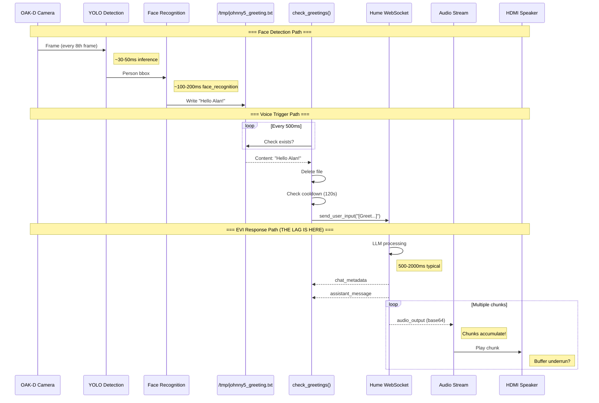
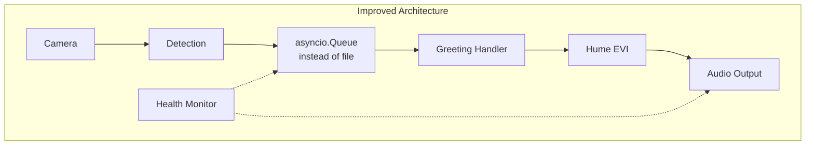

# Johnny 5 Voice Flow Analysis

## Current Architecture Issues

This document analyzes the voice latency and disappearance issues with the Johnny5 + WhoAmI integration.

---

## System Overview

```mermaid
flowchart TB
    subgraph WhoAmI["WhoAmI Process (whoami_full.py)"]
        CAM[OAK-D Camera] --> YOLO[YOLO Detection<br/>every 8 frames]
        YOLO --> FR[Face Recognition]
        FR --> VOTE[TrackedPerson.vote<br/>temporal smoothing]
        VOTE --> LOCK{Locked ID?<br/>2+ votes}
        LOCK -->|Yes, First Time| WRITE[Write greeting to<br/>/tmp/johnny5_greeting.txt]
        LOCK -->|No/Already Announced| SKIP[Skip]
    end

    subgraph Johnny5["Johnny5 Process (johnny5.py)"]
        subgraph AsyncLoop["asyncio.gather() - 3 concurrent tasks"]
            POLL[check_greetings()<br/>polls file every 0.5s]
            HANDLE[handle_messages()<br/>async for message in socket]
            MIC[MicrophoneInterface.start()<br/>captures mic → sends to Hume]
        end

        POLL -->|File exists| PARSE[Parse greeting text]
        PARSE --> SEND[socket.send_user_input<br/>❌ OLD API!]

        HANDLE --> TYPE{message.type?}
        TYPE -->|audio_output| DECODE[base64 decode]
        DECODE --> STREAM[stream.put(bytes)]
        TYPE -->|user_message| LOG1[Log + update activity]
        TYPE -->|assistant_message| LOG2[Log + update activity]

        STREAM --> PLAY[MicrophoneInterface plays<br/>from stream buffer]
    end

    subgraph Hume["Hume EVI Cloud"]
        WS[WebSocket Connection]
        ASR[Speech Recognition]
        LLM[Emotional LLM]
        TTS[TTS Generation]
    end

    WRITE -.->|File IPC| POLL
    SEND --> WS
    MIC --> WS
    WS --> TTS
    TTS --> HANDLE
```

---

## Timing Analysis



---

## Identified Issues

### Issue 1: WRONG API CALL (Critical)
```python
# CURRENT (BROKEN):
await socket.send_user_input(text=f"[Greet this person briefly]: {greeting}")

# SHOULD BE:
await socket.send_publish(UserInput(text=f"[Greet this person briefly]: {greeting}"))
```
This throws a silent error that may cause the message to never reach Hume!

### Issue 2: File-Based IPC Race Condition
```
WhoAmI writes → Johnny5 reads → Johnny5 deletes
                     ↑
           What if file changes mid-read?
           What if delete fails?
```

### Issue 3: No Audio Stream Backpressure
```python
async def on_message(message, stream):
    if message.type == "audio_output":
        await stream.put(base64.b64decode(message.data))  # No limit!
```
- Chunks pile up in the stream buffer
- If processing slows, buffer grows unbounded
- Eventually causes lag or memory issues

### Issue 4: Conversation State Machine Too Simple
```python
CONVERSATION_TIMEOUT = 30.0  # Too long? Too short?

if in_conversation and time_since_activity > CONVERSATION_TIMEOUT:
    in_conversation = False  # But WebSocket is still connected!
```
- After timeout, next face detection sends a new greeting
- But EVI might still be mid-thought or waiting
- Creates confusion in the conversation context

### Issue 5: No Latency Instrumentation
We have no timing data to know:
- How long from face detection to greeting write?
- How long from greeting write to Hume request?
- How long Hume takes to respond?
- How long audio chunks take to play?

---

## Proposed Fixes

### Fix 1: Correct API Call
```python
from hume.empathic_voice.types import UserInput

# In check_greetings():
await socket.send_publish(UserInput(text=f"[Greet this person briefly]: {greeting}"))
```

### Fix 2: Add Latency Logging
```python
def log(text: str, t0=None) -> None:
    now = datetime.datetime.now(tz=datetime.timezone.utc)
    ts = now.strftime("%H:%M:%S.%f")[:-3]  # Include milliseconds
    if t0:
        delta_ms = (now.timestamp() - t0) * 1000
        print(f"[{ts}] (+{delta_ms:.0f}ms) {text}")
    else:
        print(f"[{ts}] {text}")
```

### Fix 3: Track Audio Chunk Timing
```python
audio_first_chunk_time = None
audio_chunk_count = 0

async def on_message(message, stream):
    global audio_first_chunk_time, audio_chunk_count

    if message.type == "audio_output":
        if audio_first_chunk_time is None:
            audio_first_chunk_time = time.time()
            log("First audio chunk received")
        audio_chunk_count += 1
        await stream.put(base64.b64decode(message.data))

    elif message.type == "assistant_end":  # or similar
        if audio_first_chunk_time:
            total = time.time() - audio_first_chunk_time
            log(f"Audio complete: {audio_chunk_count} chunks in {total*1000:.0f}ms")
        audio_first_chunk_time = None
        audio_chunk_count = 0
```

### Fix 4: Add Stream Health Check
```python
# Check if stream is backing up
async def monitor_stream_health(stream):
    while True:
        # The Hume Stream class may have a size/length property
        # or we can track puts vs plays
        await asyncio.sleep(1.0)
        log(f"Stream buffer health check")
```

---

## Recommended Architecture (Future)



Replace file-based IPC with:
1. **Shared asyncio.Queue** - If same process
2. **Unix domain socket** - If separate processes
3. **Redis pub/sub** - If need persistence

---

## Testing Checklist

- [ ] Fix send_user_input → send_publish(UserInput())
- [ ] Add millisecond timestamps to all logs
- [ ] Log time from greeting detection to Hume request
- [ ] Log time from Hume request to first audio chunk
- [ ] Log total audio playback duration
- [ ] Check for stream buffer growth
- [ ] Test with shorter CONVERSATION_TIMEOUT (15s?)
- [ ] Test with shorter GREETING_COOLDOWN (60s?)
